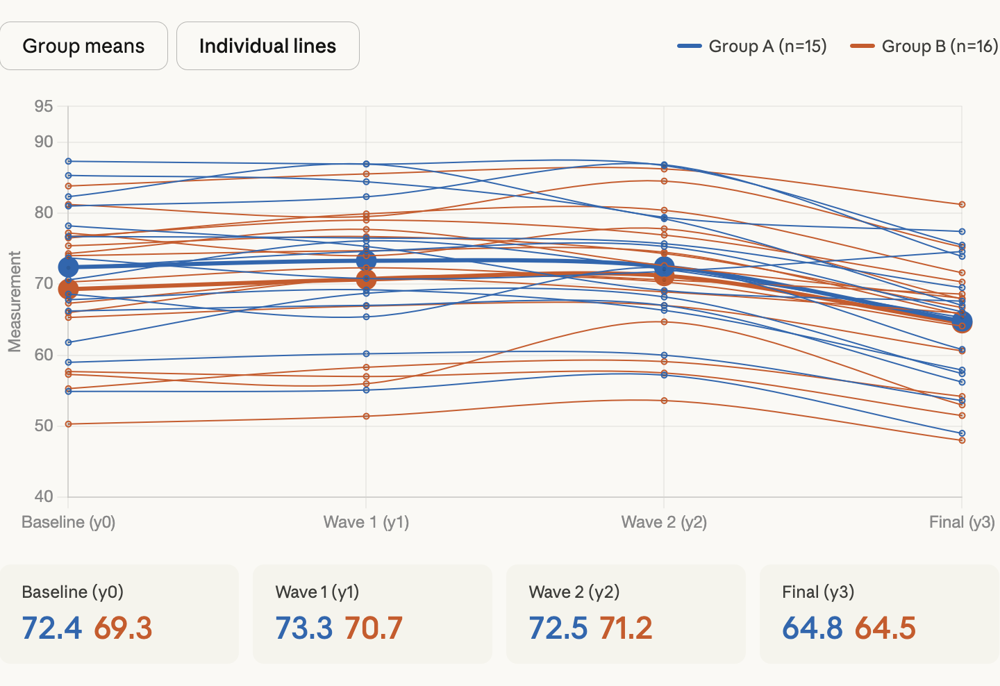

# Introduction

This report shows a reproducible data analysis using Quarto. This means that all results (tables and graphs) are created directly from code, so anyone can run the file and get the same results. The goal is to clearly explain the data and what we can learn from it.

# Busiest Airports Analysis

In this section, we look at passenger traffic for six major airports over several years. We want to see how post-pandemic air travel recovered at some of the busiest airports.

```{r}
#| echo: false
#| warning: false
#| message: false

library(tidyverse)
library(rvest)
library(knitr)
library(kableExtra)

# Read the Wikipedia page and pull all the tables from it
url <- "https://en.wikipedia.org/wiki/List_of_busiest_airports_by_passenger_traffic"
tables <- url |> read_html() |> html_table(fill = TRUE)

# Helper function to clean up each year's table
extract_year <- function(table, year) {
  table |>
    select(airport = 2, passengers = 6) |>
    mutate(
      year = year,
      passengers = passengers |>
        str_remove_all(",") |>
        str_remove_all("\\[.*?\\]") |>
        str_trim() |>
        as.numeric(),
      passengers_millions = round(passengers / 1e6, 1)
    ) |>
    filter(!is.na(passengers)) |>
    select(airport, year, passengers_millions)
}

# Pull each year's table from the full list of Wikipedia tables
data_2024 <- extract_year(tables[[2]], 2024)
data_2023 <- extract_year(tables[[3]], 2023)
data_2022 <- extract_year(tables[[4]], 2022)
data_2021 <- extract_year(tables[[5]], 2021)
data_2020 <- extract_year(tables[[6]], 2020)

# The six airports we want to keep
airports_selected <- c(
  "Hartsfield\u2013Jackson Atlanta International Airport",
  "Dallas Fort Worth International Airport",
  "Dubai International Airport",
  "Heathrow Airport",
  "Frankfurt Airport",
  "Beijing Daxing International Airport"
)

# Stack all five years, filter to our six airports, and add short code and country columns
airports_long <- bind_rows(data_2024, data_2023, data_2022, data_2021, data_2020) |>
  filter(airport %in% airports_selected) |>
  mutate(
    code = case_when(
      str_detect(airport, "Atlanta")   ~ "ATL",
      str_detect(airport, "Dallas")    ~ "DFW",
      str_detect(airport, "Dubai")     ~ "DXB",
      str_detect(airport, "Heathrow")  ~ "LHR",
      str_detect(airport, "Frankfurt") ~ "FRA",
      str_detect(airport, "Daxing")    ~ "PKX"
    ),
    country = case_when(
      str_detect(airport, "Atlanta")   ~ "United States",
      str_detect(airport, "Dallas")    ~ "United States",
      str_detect(airport, "Dubai")     ~ "United Arab Emirates",
      str_detect(airport, "Heathrow")  ~ "United Kingdom",
      str_detect(airport, "Frankfurt") ~ "Germany",
      str_detect(airport, "Daxing")    ~ "China"
    ),
    year = as.integer(year)
  ) |>
  arrange(code, year)

# Pivot to wide format so each year is its own column
airports_wide <- airports_long |>
  pivot_wider(names_from = year, values_from = passengers_millions) |>
  arrange(desc(`2024`)) |>
  select(airport, code, country, `2020`, `2021`, `2022`, `2023`, `2024`)

# Build the polished table
airports_table <- kable(
  airports_wide,
  format    = "latex",
  booktabs  = TRUE,
  digits    = 1,
  caption   = "Passenger Traffic at Six Major International Airports (millions, 2020--2024)",
  col.names = c("Airport", "Code", "Country", "2020", "2021", "2022", "2023", "2024")
) |>
  kable_styling(latex_options = c("striped", "hold_position", "scale_down")) |>
  add_header_above(c(" " = 3, "Passengers (millions)" = 5)) |>
  column_spec(1, bold = TRUE)

# Create short airport name labels for a clean plot
airports_plot_data <- airports_long |>
  mutate(label = case_when(
    code == "ATL" ~ "Atlanta (ATL)",
    code == "DFW" ~ "Dallas (DFW)",
    code == "DXB" ~ "Dubai (DXB)",
    code == "LHR" ~ "Heathrow (LHR)",
    code == "FRA" ~ "Frankfurt (FRA)",
    code == "PKX" ~ "Beijing Daxing (PKX)"
  ))

# High-contrast color palette, one color per airport
airport_colors <- c(
  "Atlanta (ATL)"        = "#0072B2",
  "Dallas (DFW)"         = "#E69F00",
  "Dubai (DXB)"          = "#009E73",
  "Heathrow (LHR)"       = "#D55E00",
  "Frankfurt (FRA)"      = "#CC79A7",
  "Beijing Daxing (PKX)" = "#56B4E9"
)

# Create the plot
airports_plot <- ggplot(airports_plot_data, aes(x = year, y = passengers_millions, color = label, group = label)) +
  geom_line(linewidth = 1.2) +
  geom_point(size = 3) +
  scale_color_manual(values = airport_colors) +
  scale_x_continuous(breaks = c(2020, 2021, 2022, 2023, 2024)) +
  scale_y_continuous(limits = c(0, 120), breaks = seq(0, 120, by = 20)) +
  labs(
    title    = "Passenger Traffic at Six Major International Airports",
    subtitle = "Total passengers in millions (2020\u20132024)",
    x        = "Year",
    y        = "Passengers (millions)",
    color    = "Airport"
  ) +
  theme_minimal(base_size = 13) +
  theme(
    plot.title       = element_text(face = "bold"),
    plot.subtitle    = element_text(color = "gray40"),
    legend.position  = "right",
    panel.grid.minor = element_blank()
  )

# Display the table and plot
airports_table
airports_plot
```

Together, the table and line chart reveal the miraculous recovery of global air travel following the COVID-19 pandemic. Heathrow (LHR) has no 2021 data, while Beijing Daxing (PKX) is missing 2020, 2022 and 2023 entirely due to complete shutdowns caused by the pandemic. When LHR opened up in 2022, it reached 61.6 million passengers, with steady increases in the next few years. In 2021, PKX only had 25.1 million passengers, but reached almost double that amount with 49.4 million when it opened back up in 2024. Dubai (DXB) shows the most dramatic rebound, tripling from 29.1 million in 2021 to 87.0 million by 2023, further showing how quickly airline travel recovered. The line chart makes this surge apparent, with Dubai's line crossing above Dallas and Heathrow by 2023. By 2024, most airports saw steady increases instead of drastic ones, suggesting that air traffic is stabilizing instead of still recovering. Overall, both visualizations reinforce that recovery speed depended heavily on government policy and airport type, along with passenger demand.

# Monte Carlo Simulation 

```{r}
#| echo: false
#| warning: false
#| message: false

library(patchwork)

# Generates n random (x, y) points within the defined bounding box
monte_carlo_sim <- function(n, x_min, x_max, y_min, y_max) {
  data.frame(
    x = runif(n, min = x_min, max = x_max),
    y = runif(n, min = y_min, max = y_max)
  )
}

# Helper to build one Monte Carlo panel plot for a given sample size
make_mc_plot <- function(n) {
  
  # Simulate random points and flag whether each is above or below the curve
  sim_data <- monte_carlo_sim(n = n, x_min = 0, x_max = 4,
                               y_min = 0, y_max = 0.8) |>
    mutate(flag = if_else(
      y > dweibull(x, shape = 1.5, scale = 1), "above", "on/below"
    ))
  
  # Estimate the integral: fraction below the curve × area of bounding box
  est <- round(mean(sim_data$flag == "on/below") * (4 * 0.8), 4)
  
  ggplot(sim_data, aes(x = x, y = y, color = flag)) +
    geom_point(alpha = 0.5, size = 0.8) +
    stat_function(
      fun  = dweibull,
      args = list(shape = 1.5, scale = 1),
      xlim = c(0, 4),
      color = "blue",
      linewidth = 1
    ) +
    scale_color_manual(values = c("above" = "red", "on/below" = "yellowgreen")) +
    labs(
      title    = paste0("n = ", formatC(n, format = "d", big.mark = ",")),
      subtitle = paste("Estimate:", est),
      x = "x", y = "y",
      color = "Point"
    ) +
    theme_bw(base_size = 10) +
    theme(legend.position = "bottom")
}

# Create one plot object per panel
mc_plot_10    <- make_mc_plot(10)
mc_plot_100   <- make_mc_plot(100)
mc_plot_1000  <- make_mc_plot(1000)
mc_plot_10000 <- make_mc_plot(10000)

combined <- (mc_plot_10 | mc_plot_100) / (mc_plot_1000 | mc_plot_10000)
print(combined)

```

Monte Carlo numerical integration estimates the area under a curve by randomly scattering points across a rectangular bounding box and recording what fraction of them land below the function. That fraction is multiplied by the total area of the rectangle and gives an estimate of the integral. As more points are used, the rectangle gets covered more densely which makes the estimate more reliable. In this analysis, the function being integrated is the Weibull probability density function with shape = 1.5 and scale = 1. When evaluated over the interval \[0, 4\] within a bounding box of 0 to 0.8 on the y-axis, the estimated area is 4 x 0.8 = 3.2.

## Small Multiple Visualization

```{r}
#| echo: false
#| warning: false
#| message: false

library(patchwork)

# Function to generate random points
monte_carlo_sim <- function(n, x_min, x_max, y_min, y_max) {
  data.frame(
    x = runif(n, min = x_min, max = x_max),
    y = runif(n, min = y_min, max = y_max)
  )
}

# Function to create one panel plot for a given sample size
make_mc_plot <- function(n) {
  sim_data <- monte_carlo_sim(n, 0, 4, 0, 0.8) |>
    mutate(flag = if_else(y > dweibull(x, shape = 1.5, scale = 1), "above", "on/below"))
  est <- round(mean(sim_data$flag == "on/below") * (4 * 0.8), 4)
  ggplot(sim_data, aes(x = x, y = y, color = flag)) +
    geom_point(alpha = 0.5, size = 0.8) +
    stat_function(fun = dweibull, args = list(shape = 1.5, scale = 1), xlim = c(0, 4), color = "blue", linewidth = 1) +
    scale_color_manual(values = c("above" = "red", "on/below" = "yellowgreen")) +
    labs(title = paste0("n = ", formatC(n, format = "d", big.mark = ",")), subtitle = paste("Estimate:", est)) +
    theme_bw(base_size = 10) +
    theme(legend.position = "bottom")
}

# Create the four plots
mc_plot_10    <- make_mc_plot(10)
mc_plot_100   <- make_mc_plot(100)
mc_plot_1000  <- make_mc_plot(1000)
mc_plot_10000 <- make_mc_plot(10000)

# Combine them into a 2x2 grid and display
(mc_plot_10 | mc_plot_100) / (mc_plot_1000 | mc_plot_10000)


```

The series of small multiples shows Monte Carlo numerical integration of the Weibull probability density function (shape = 1.5, scale = 1) over the interval \[0, 4\] in four scenarios. The sample size dramatically affects the visual clarity and accuracy of each estimate. At n = 10, the estimate of 0.64 is highly inaccurate, with the random sample placing most points above the curve, misrepresenting the true proportion. At n = 100, the estimate increases to 0.736, and by n = 1000 and n = 10000, the estimates stabilize at 0.9728 and 1.0067. Based on this convergence pattern, I believe the exact answer to the integration is 1.0. The Weibull function is a valid probability density function, meaning its total area must integrate to exactly 1 over the range 0 to infinity. The bounds of 0 to 4 capture nearly all of this area since the curve is near zero before x = 4 in all four panels. Also, by n = 10000, the curve is filled with red and green points, meaning the sample size is adequate and the estimate of 1.0067 provides strong evidence that the true answer is exactly 1. 

# Planning and Prompting GenAI Tools

## New Data Context

This dataset comes from a longitudinal study that followed 31 women over four years. At the start of the study, researchers measured the amount of calcium in the ulna of each woman's dominant arm using photon absorptiometry. For the study, the null group was made up of 15 women who received no special treatment, while the remaining 16 women followed a structured diet and exercise program and were the treatment group. Each woman had her ulnar calcium level measured once per year across four time points (an initial measurement and the next three years that followed).

## Plan

Before using a GenAI tool, I made a plan:

**Goal:** Create a visualization that shows how ulnar calcium levels change over four years for each treatment group, allowing for comparisons of the trajectory of the null treatment group against the diet/exercise group.

**Tidying steps:** 1. Read in the CSV and manually assign proper column names. 2. Name the first four columns null_y0, null_y1, null_y2, null_y3 and the last four diet_y0, diet_y1, diet_y2, diet_y3. 3. Add a subject ID column to track each woman across time points. 4. Separate the null group columns and the diet/exercise group columns into two data frames. 5. Add a group column to each. 6. Pivot each data frame from wide to long format so the four time point columns become two columns (time and calcium). 7. Stack the two long data frames together using bind_rows() into one single tidy data frame.

**Wrangling steps:** 1. Convert time to an ordered factor so the x-axis plots in the correct sequence (Initial, Year 1, Year 2, Year 3). 2. Group by time and group. 3. Calculate the mean calcium level per group per time point to summarize across all subjects.


## Post-prompt visualization 

```{r}
#| echo: false
#| warning: false
#| message: false

# Read and rename columns manually
calcium_raw <- read_csv(
  "calcium.csv",
  col_names = c("null_y0","null_y1","null_y2","null_y3",
                "diet_y0","diet_y1","diet_y2","diet_y3"),
  skip = 1
) |> mutate(subject = row_number())

null_long <- calcium_raw |>
  select(subject, null_y0:null_y3) |>
  pivot_longer(null_y0:null_y3, names_to = "time", values_to = "calcium") |>
  mutate(group = "Control (Null)", time = str_remove(time, "null_"))

diet_long <- calcium_raw |>
  select(subject, diet_y0:diet_y3) |>
  pivot_longer(diet_y0:diet_y3, names_to = "time", values_to = "calcium") |>
  mutate(group = "Diet/Exercise", time = str_remove(time, "diet_"))

calcium_long <- bind_rows(null_long, diet_long) |>
  filter(!is.na(calcium)) |>
  mutate(
    time  = factor(time, levels = c("y0","y1","y2","y3"),
                   labels = c("Initial","Year 1","Year 2","Year 3")),
    group = factor(group, levels = c("Control (Null)","Diet/Exercise"))
  )

calcium_means <- calcium_long |>
  group_by(group, time) |>
  summarise(mean_calcium = mean(calcium, na.rm = TRUE), .groups = "drop")

ggplot() +
  geom_line(data = calcium_long,
            aes(x = time, y = calcium,
                group = interaction(subject, group), color = group),
            alpha = 0.25, linewidth = 0.4) +
  geom_line(data = calcium_means,
            aes(x = time, y = mean_calcium, group = group, color = group),
            linewidth = 1.4) +
  geom_point(data = calcium_means,
             aes(x = time, y = mean_calcium, color = group), size = 3) +
  scale_color_manual(
    values = c("Control (Null)" = "#D55E00", "Diet/Exercise" = "#0072B2")
  ) +
  labs(title    = "Ulnar Calcium Levels Over Four Years by Treatment Group",
       subtitle = "Bold lines = group means; faint lines = individual subjects",
       x = "Time Point", y = "Ulnar Calcium (units)", color = "Group") +
  theme_minimal(base_size = 13) +
  theme(legend.position = "bottom")
```

The visualization shows each woman's ulnar calcium trajectory as a faint individual line, with an overlay of bold lines to represent the group means. Both groups begin at similar calcium levels, then end at nearly identical levels. The individual lines reveal considerable variation within each group, suggesting that personal factors beyond treatment assignment also influence calcium retention over time.

## Comparison

The plan‑based prompt produced complete, ready‑to‑run R code that tidied the data exactly as specified. It also generated a clear ggplot visualization that combined thin individual subject trajectories with bold group mean lines, directly aligning with the  goals I gave it. The code required minimal revisions and immediately answered the research question. In contrast, the generic prompt led Claude to provide no actual code. Instead, it gave a descriptive narrative accompanied by two static visualizations(provided in Appendix), one summarizing group means across time and the other displaying individual subject patterns. Although these plots were informative, they were not reproducible and could not be directly modified or extended. This demonstrates that vague prompts tend to yield descriptive outputs chosen by the AI, whereas a structured plan can reliably produce specific and reproducible code that's suitable for formal data analysis.

# Reflection

Overall, taking STAT 184 has reshaped how I approach data analysis by emphasizing reproducibility and clarity. It also taught me the importance of planning as lengthy projects require more in-depth thinking to make sure they're successful. Before the course, I had no experience with data wrangling or tidying. This is an extremely useful skill that I've gotten to practice, especially during the airport project. Here I needed clear naming, commenting, and structure to make the work easy to understand. Learning tidyverse was also valuable, with tools like pivot_longer(), group_by(), and mutate(), making data wrangling more intuitive. Lastly, the Monte Carlo integration was vital because it showed how simulations and larger sample sizes can give abstract ideas applications in the real world.

# Appendix: GenAI Usage

## Tool Used

Anthropic Claude | Claude Sonnet 4.6(claude.ai)

## Usage 1: Plan-based prompt

"I have a CSV file called calcium.csv from a longitudinal study of 31 women. The file has 8 columns with duplicate headers (y0, y1, y2, y3, y0, y1, y2, y3) — the first four are the control/null group (15 women) and the last four are the diet/exercise group (16 women), measuring ulnar calcium at four time points. Here is my plan: (1) Read the CSV and manually assign column names null_y0 through null_y3 and diet_y0 through diet_y3, skipping the header row. (2) Add a subject ID. (3) Pivot each group to long format, add a group column, and bind_rows() them together. (4) Convert time to an ordered factor with labels Initial, Year 1, Year 2, Year 3. (5) Compute group means at each time point. (6) Build a ggplot line chart with thin semi-transparent individual lines in the background and bold group mean lines in the foreground, colored by group. Write the full R tidyverse code following this plan"

**Response from Claude (Sonnet 4.6, April 12th, 2026):**

```{r}
#| eval: false
#| echo: true

# Read and rename columns manually
calcium_raw <- read_csv(
  "calcium.csv",
  col_names = c("null_y0","null_y1","null_y2","null_y3",
                "diet_y0","diet_y1","diet_y2","diet_y3"),
  skip = 1
) |> mutate(subject = row_number())

null_long <- calcium_raw |>
  select(subject, null_y0:null_y3) |>
  pivot_longer(null_y0:null_y3, names_to = "time", values_to = "calcium") |>
  mutate(group = "Control (Null)", time = str_remove(time, "null_"))

diet_long <- calcium_raw |>
  select(subject, diet_y0:diet_y3) |>
  pivot_longer(diet_y0:diet_y3, names_to = "time", values_to = "calcium") |>
  mutate(group = "Diet/Exercise", time = str_remove(time, "diet_"))

calcium_long <- bind_rows(null_long, diet_long) |>
  filter(!is.na(calcium)) |>
  mutate(
    time  = factor(time, levels = c("y0","y1","y2","y3"),
                   labels = c("Initial","Year 1","Year 2","Year 3")),
    group = factor(group, levels = c("Control (Null)","Diet/Exercise"))
  )

calcium_means <- calcium_long |>
  group_by(group, time) |>
  summarise(mean_calcium = mean(calcium, na.rm = TRUE), .groups = "drop")

ggplot() +
  geom_line(data = calcium_long,
            aes(x = time, y = calcium,
                group = interaction(subject, group), color = group),
            alpha = 0.25, linewidth = 0.4) +
  geom_line(data = calcium_means,
            aes(x = time, y = mean_calcium, group = group, color = group),
            linewidth = 1.4) +
  geom_point(data = calcium_means,
             aes(x = time, y = mean_calcium, color = group), size = 3) +
  scale_color_manual(
    values = c("Control (Null)" = "#D55E00", "Diet/Exercise" = "#0072B2")
  ) +
  labs(title    = "Ulnar Calcium Levels Over Four Years by Treatment Group",
       subtitle = "Bold lines = group means; faint lines = individual subjects",
       x = "Time Point", y = "Ulnar Calcium (units)", color = "Group") +
  theme_minimal(base_size = 13) +
  theme(legend.position = "bottom")
```

## Usage 2: Generic prompt

"Create a data visualization that will help me understand these data. Calclium.csv"

**Response from Claude (Sonnet 4.6, March 31, 2026):**

Here's what stands out in the data:

**Both groups follow the same pattern** — values stay relatively stable across the first three waves (y0 → y1 → y2), then drop noticeably at the final measurement (y3). This sharp decline at y3 is the dominant signal.

**Group A starts slightly higher** (baseline mean ~72.4 vs. ~69.3 for Group B), but both groups converge to nearly identical final values (~64.8 and ~64.5). That convergence is interesting — Group A drops about 7.5 points while Group B drops about 4.8.

**There's substantial individual variation** — hit the "Individual lines" toggle to see this. Some participants stay high throughout, others are consistently low, and a few show unusual trajectories (one in Group A actually rises at y3 while most fall).

**Visualizations:**




If you can share what the groups represent (e.g., treatment vs. control, or different diets/supplements) and what's being measured, I can dig into the statistics more precisely.

# Appendix: Code

```{r}
#| eval: false
#| echo: true
#| results: hide

library(tidyverse)
library(rvest)
library(knitr)
library(kableExtra)
library(patchwork)

# Read the Wikipedia page and pull all the tables from it
url <- "https://en.wikipedia.org/wiki/List_of_busiest_airports_by_passenger_traffic"
tables <- url |> read_html() |> html_table(fill = TRUE)

# Helper function to clean up each year's table
extract_year <- function(table, year) {
  table |>
    select(airport = 2, passengers = 6) |>
    mutate(
      year = year,
      passengers = passengers |>
        str_remove_all(",") |>
        str_remove_all("\\[.*?\\]") |>
        str_trim() |>
        as.numeric(),
      passengers_millions = round(passengers / 1e6, 1)
    ) |>
    filter(!is.na(passengers)) |>
    select(airport, year, passengers_millions)
}

# Pull each year's table from the full list of Wikipedia tables
data_2024 <- extract_year(tables[[2]], 2024)
data_2023 <- extract_year(tables[[3]], 2023)
data_2022 <- extract_year(tables[[4]], 2022)
data_2021 <- extract_year(tables[[5]], 2021)
data_2020 <- extract_year(tables[[6]], 2020)

# The six airports we want to keep
airports_selected <- c(
  "Hartsfield\u2013Jackson Atlanta International Airport",
  "Dallas Fort Worth International Airport",
  "Dubai International Airport",
  "Heathrow Airport",
  "Frankfurt Airport",
  "Beijing Daxing International Airport"
)

# Stack all five years, filter to our six airports, and add short code and country columns
airports_long <- bind_rows(data_2024, data_2023, data_2022, data_2021, data_2020) |>
  filter(airport %in% airports_selected) |>
  mutate(
    code = case_when(
      str_detect(airport, "Atlanta")   ~ "ATL",
      str_detect(airport, "Dallas")    ~ "DFW",
      str_detect(airport, "Dubai")     ~ "DXB",
      str_detect(airport, "Heathrow")  ~ "LHR",
      str_detect(airport, "Frankfurt") ~ "FRA",
      str_detect(airport, "Daxing")    ~ "PKX"
    ),
    country = case_when(
      str_detect(airport, "Atlanta")   ~ "United States",
      str_detect(airport, "Dallas")    ~ "United States",
      str_detect(airport, "Dubai")     ~ "United Arab Emirates",
      str_detect(airport, "Heathrow")  ~ "United Kingdom",
      str_detect(airport, "Frankfurt") ~ "Germany",
      str_detect(airport, "Daxing")    ~ "China"
    ),
    year = as.integer(year)
  ) |>
  arrange(code, year)

# Pivot to wide format so each year is its own column
airports_wide <- airports_long |>
  pivot_wider(names_from = year, values_from = passengers_millions) |>
  arrange(desc(`2024`)) |>
  select(airport, code, country, `2020`, `2021`, `2022`, `2023`, `2024`)

# Build the polished table
airports_table <- kable(
  airports_wide,
  format    = "latex",
  booktabs  = TRUE,
  digits    = 1,
  caption   = "Passenger Traffic at Six Major International Airports (millions, 2020--2024)",
  col.names = c("Airport", "Code", "Country", "2020", "2021", "2022", "2023", "2024")
) |>
  kable_styling(latex_options = c("striped", "hold_position", "scale_down")) |>
  add_header_above(c(" " = 3, "Passengers (millions)" = 5)) |>
  column_spec(1, bold = TRUE)

# Create short airport name labels for a clean plot
airports_plot_data <- airports_long |>
  mutate(label = case_when(
    code == "ATL" ~ "Atlanta (ATL)",
    code == "DFW" ~ "Dallas (DFW)",
    code == "DXB" ~ "Dubai (DXB)",
    code == "LHR" ~ "Heathrow (LHR)",
    code == "FRA" ~ "Frankfurt (FRA)",
    code == "PKX" ~ "Beijing Daxing (PKX)"
  ))

# High-contrast color palette, one color per airport
airport_colors <- c(
  "Atlanta (ATL)"        = "#0072B2",
  "Dallas (DFW)"         = "#E69F00",
  "Dubai (DXB)"          = "#009E73",
  "Heathrow (LHR)"       = "#D55E00",
  "Frankfurt (FRA)"      = "#CC79A7",
  "Beijing Daxing (PKX)" = "#56B4E9"
)

# Create the plot
airports_plot <- ggplot(airports_plot_data, aes(x = year, y = passengers_millions, color = label, group = label)) +
  geom_line(linewidth = 1.2) +
  geom_point(size = 3) +
  scale_color_manual(values = airport_colors) +
  scale_x_continuous(breaks = c(2020, 2021, 2022, 2023, 2024)) +
  scale_y_continuous(limits = c(0, 120), breaks = seq(0, 120, by = 20)) +
  labs(
    title    = "Passenger Traffic at Six Major International Airports",
    subtitle = "Total passengers in millions (2020\u20132024)",
    x        = "Year",
    y        = "Passengers (millions)",
    color    = "Airport"
  ) +
  theme_minimal(base_size = 13) +
  theme(
    plot.title       = element_text(face = "bold"),
    plot.subtitle    = element_text(color = "gray40"),
    legend.position  = "right",
    panel.grid.minor = element_blank()
  )

# Display the table and plot
airports_table
airports_plot

# -----------------------------
# Monte Carlo Code
# -----------------------------

#| echo: false
#| warning: false
#| message: false

library(patchwork)

# Function to generate random points
monte_carlo_sim <- function(n, x_min, x_max, y_min, y_max) {
  data.frame(
    x = runif(n, min = x_min, max = x_max),
    y = runif(n, min = y_min, max = y_max)
  )
}

# Function to create one panel plot for a given sample size
make_mc_plot <- function(n) {
  sim_data <- monte_carlo_sim(n, 0, 4, 0, 0.8) |>
    mutate(flag = if_else(y > dweibull(x, shape = 1.5, scale = 1), "above", "on/below"))
  est <- round(mean(sim_data$flag == "on/below") * (4 * 0.8), 4)
  ggplot(sim_data, aes(x = x, y = y, color = flag)) +
    geom_point(alpha = 0.5, size = 0.8) +
    stat_function(fun = dweibull, args = list(shape = 1.5, scale = 1), xlim = c(0, 4), color = "blue", linewidth = 1) +
    scale_color_manual(values = c("above" = "red", "on/below" = "yellowgreen")) +
    labs(title = paste0("n = ", formatC(n, format = "d", big.mark = ",")), subtitle = paste("Estimate:", est)) +
    theme_bw(base_size = 10) +
    theme(legend.position = "bottom")
}

# Create the four plots
mc_plot_10    <- make_mc_plot(10)
mc_plot_100   <- make_mc_plot(100)
mc_plot_1000  <- make_mc_plot(1000)
mc_plot_10000 <- make_mc_plot(10000)

# Combine them into a 2x2 grid and display
(mc_plot_10 | mc_plot_100) / (mc_plot_1000 | mc_plot_10000)

```
